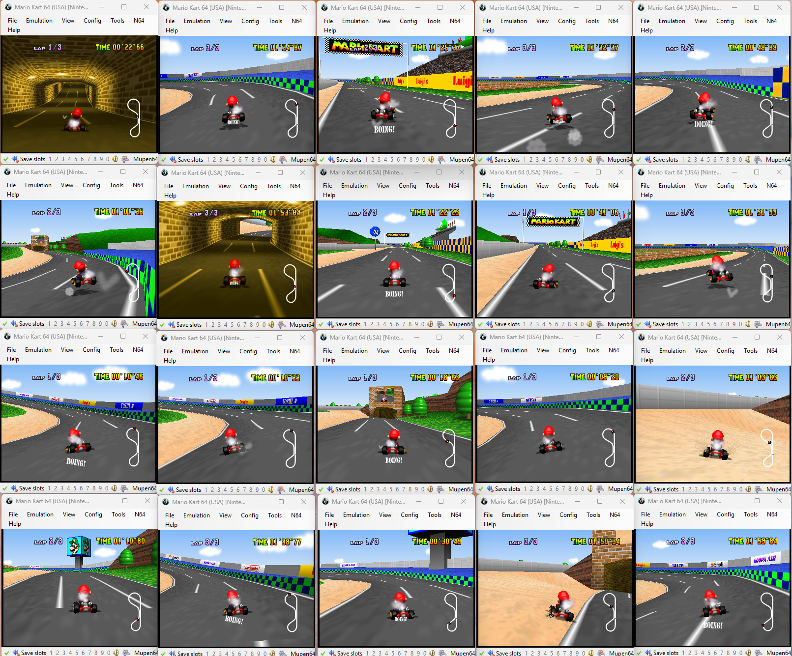

# TorchKart

TorchKart is a modern implementation of a Proximal Policy Optimization Agent learning to play Mario Kart 64. 



## Components

### `mk64_interface.lua`

This is a Lua script written to interface between the BizHawk emulator and the Python server running the PPO. 
It uses sockets to communicate, and handles reading data from memory, sending it to the server, receiving commands, 
and executing them. 

In the file you can add/modify the memory values that are read, change the discrete action space, and add/remove 
commands that the server will send to the client. 


### `torchkart.py/MK64Env`

This is a custom [Gymnasium](https://github.com/Farama-Foundation/Gymnasium) wrapper for Mario Kart 64. It handles
most of the logic of the application, including the parsing and pre-processing of the raw memory data, reward function, 
resetting the environment, and stepping. 


### `torchkart.py/ActorCritic`

This is the main PPO implementation, implementing the dual Actor/Critic networks used, as well as getters. 

## Results

[View the results here](docs/torchkart.pdf).

## Installation

### Setup Environment

To begin, obtain a legal ROM for Mario Kart 64, rename it to `marioKart.n64`, and place it in the `rom` directory.

The version of BizHawk used for this project is `2.11 (x64)` for Microsoft Windows. The emulator can be downloaded
[here](https://github.com/TASEmulators/BizHawk/releases/tag/2.11). Note that the Windows binary is the only version
supported by this program. 

- Create a new folder called `bizhawk` that will be used to store the required files for the BizHawk emulator. 
- Decompress the contents of `BizHawk-2.11-win-x64.zip` into the `bizhawk` folder. 
- Copy the contents of the `Lua` folder into the `bizhawk/Lua` folder. This will provide the necessary files needed for 
the socket implementation. 
- Open the `launch_training.ps1` script, and change the `$RomPath` to the absolute path of your ROM file. 

### Create a Save State

Run the `launch_training.ps1` script with no parameters. One EmuHawk emulator will open with the ROM loaded. Progress
through the menus and start a new time trial on the course of your choosing (the main one tested on was Luigi's 
Circuit). 

When the race begins, go to `File`, `Save State`, and `Save Named State...`. Save the state to the project root folder 
as `mk64_start.state`. This will be the state that is loaded when the environment tells the client to reset. 

Open the `mk64_interface.lua` script and change the `SAVESTATE_PATH` to the absolute path of your save state file. 

### (Optional) Set Up TensorBoard

Tensorboard can be used to visualize agent performance over time. 

- Install TensorBoard with `pip install tensorboard`
- Run it with `python -m tensorboard.main --logdir=runs`

Tensorboard will be accessible on localhost at `http://localhost:6006`.

## Start Training

To run the app, start the `torchkart.py` script with:

```
python torchkart.py --num_envs=20 --total_timesteps=250000000 save_interval=60
```

This will run the script waiting for 20 BizHawk clients, and will run for 250M steps, saving every 60 updates. 

Next, to start the BizHawk Clients, run `./launch_training.ps1 -NumEnvs=20`. 

Watch the python terminal for the 20 successful connections, and upon the 20 connections the training will begin
immediately. 

### Loading a Checkpoint

To run the app from a checkpoint, add the `--load_checkpoint` flag and set it to the absolute path of a `.pth` file you
want to load. These files are automatically saved in the `runs` folder. 
