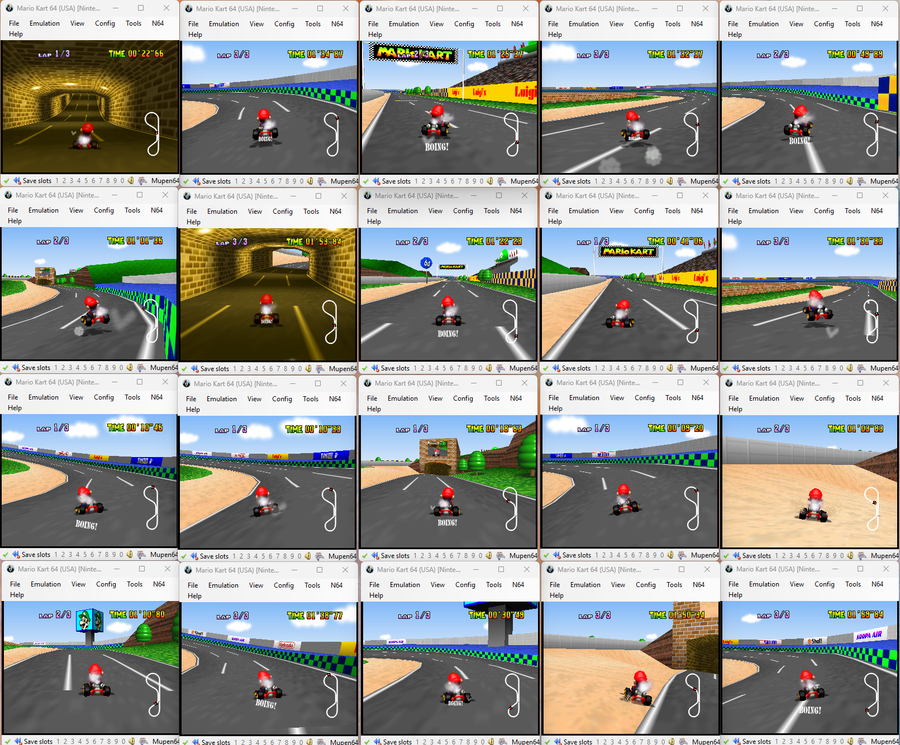

# TorchKart

TorchKart is a modern Proximal Policy Optimization (PPO) agent for Mario Kart 64, featuring a modular training pipeline, a causal Transformer policy for long-range temporal reasoning, and an imitation-learning pre-training stage. The codebase has been reorganized from a single monolithic script into a clean `src/` package for easier experimentation.

> **Latest Advancement:** Causal Transformer policy architecture replacing frame stacking with attention-based temporal reasoning, along with a full imitation-learning pipeline and automatic emulator management.



## Components

### `mk64_interface.lua`

A Lua script that interfaces between the BizHawk emulator and the Python server. It uses TCP sockets to communicate, reading game memory, sending state data to the server, receiving commands, and executing them. It supports multi-discrete actions (`throttle`, `steering`, `drift`, `item`), frame skipping, and a demo recording mode for imitation learning.

See [`docs/mk64_interface.md`](docs/mk64_interface.md) for full details on the protocol and memory map.


### `src/environment.py` / `MK64Env`

A custom [Gymnasium](https://github.com/Farama-Foundation/Gymnasium) vectorized environment for Mario Kart 64. It handles parsing and pre-processing raw memory bytes into 14 normalized observation features, computing shaped rewards (progress, speed, wall hits, drift boosts, mushroom usage), frame skipping to reduce network traffic, frame stacking for temporal context, stuck detection, and automatic crash recovery via `EmulatorManager`.

The action space is `MultiDiscrete([3, 5, 2, 2])` for `[throttle, steering, drift, item]`.


### `src/agent.py` / `ActorCriticMLP` & `ActorCriticTransformer`

Two policy architectures:

- **ActorCriticMLP** (default): A shared-body MLP with separate actor heads per action dimension. Uses frame stacking for temporal context.
- **ActorCriticTransformer**: A causal transformer that attends over a sequence of observation frames, replacing frame stacking with attention-based temporal reasoning. Enabled with `--use-transformer`.

Both architectures use orthogonal weight initialization and per-head action distributions.

## Results

[View the results here](docs/torchkart.pdf).

## Installation

### Setup Environment

To begin, obtain a legal ROM for Mario Kart 64, rename it to `marioKart.n64`, and place it in the `rom` directory.

The version of BizHawk used for this project is `2.11 (x64)` for Microsoft Windows. The emulator can be downloaded
[here](https://github.com/TASEmulators/BizHawk/releases/tag/2.11). Note that the Windows binary is the only version
supported by this program.

- Create a new folder called `bizhawk` that will be used to store the required files for the BizHawk emulator.
- Decompress the contents of `BizHawk-2.11-win-x64.zip` into the `bizhawk` folder.
- Copy the contents of the `Lua` folder into the `bizhawk/Lua` folder. Click yes if it asks to replace any files.

### Create a Save State

Run `python launch_emulators.py --num-envs=1` to open one EmuHawk instance with the ROM loaded. Progress
through the menus and start a new time trial on the course of your choosing (the main one tested on was Luigi's
Circuit).

When the race begins, go to `File`, `Save State`, and `Save Named State...`. Save the state to the project root folder
as `mk64_start.state`. This will be the state that is loaded when the environment tells the client to reset.

Open `mk64_interface.lua` and change `SAVESTATE_PATH` to the absolute path of your save state file.

### (Optional) Set Up TensorBoard

TensorBoard can be used to visualize agent performance over time.

- Install TensorBoard with `pip install tensorboard`
- Run it with `python -m tensorboard.main --logdir=runs`

TensorBoard will be accessible on localhost at `http://localhost:6006`.

## Start Training

A single command launches the emulators and starts training:

```
python main.py --num-envs=20 --total-timesteps=250000000 --save-interval=60
```

The training script automatically launches the BizHawk emulators, waits for all clients to connect, then begins training. Emulators are arranged in a grid on the left side of your screen — control the layout with `--grid-cols` (default 5) and `--grid-fraction` (default 0.33).

If you prefer to manage emulators manually (e.g., for distributed setups), you can still use `launch_emulators.py` in a separate terminal and run `main.py` without the auto-launch.

### Loading a Checkpoint

To resume from a checkpoint, add the `--load-checkpoint` flag:

```
python main.py --num-envs=20 --load-checkpoint=runs/<experiment>/checkpoint_update_N.pth
```

This restores agent weights, optimizer state, the update counter, and global step.

## Imitation Learning Pipeline

You can pre-train the policy on human demonstrations before running PPO:

```bash
# 1. Record a demo (drive the kart yourself)
python -m src.record_demo --output demos/my_demo.npz

# 2. Pre-train with behavioral cloning (use --use-transformer if fine-tuning a Transformer)
python -m src.pretrain --demo-files demos/my_demo.npz \
    --output demos/bc_pretrained.pth \
    --seq-length=8            # match your training config

# 3. Fine-tune with PPO
python main.py --load-checkpoint demos/bc_pretrained.pth
```

The sequence length and architecture used for pre-training must match those you choose for the PPO training run. Use `--use-transformer` and the same `--seq-length` in `src.pretrain` when pre-training for the Transformer policy. 

## Architecture Options

To use the Transformer policy instead of the default MLP:

```
python main.py --use-transformer --seq-length=1024
```

See [`docs/hyperparameters.md`](docs/hyperparameters.md) for the full list of configurable parameters.
